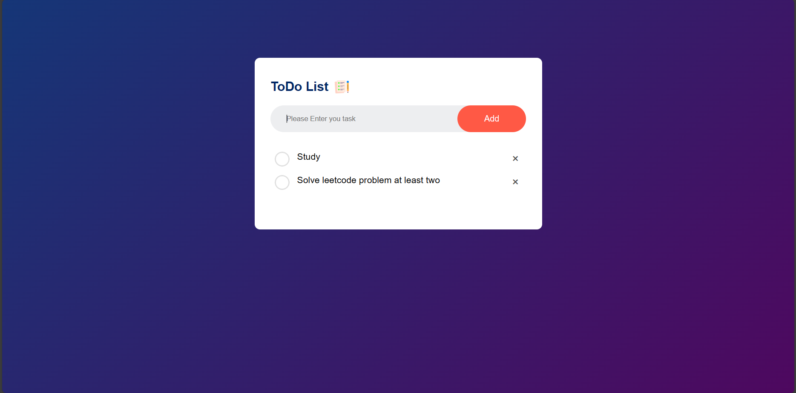

# To-Do Website
This is a simple To-Do List web application that allows you to manage your tasks efficiently. You can add tasks, mark them as completed, and delete them as needed.


## Features

- Add tasks to your to-do list.
- Mark tasks as completed by clicking on them.
- Delete tasks by clicking the "x" button.
- Your to-do list data is saved in your browser's local storage, so your tasks will persist even after closing the browser.

## Tech Stack

- HTML
- CSS
- Javascript


##  Getting Started

To run this app locally, follow these steps:

1. Clone this repository to your local machine:

```
git clone https://github.com/KhushalYadav535/Todo-website.git

```


2. Open the `index.html` file in your web browser.


## Usage

- To add a task, type it in the input box and click the "Add" button.
- To mark a task as completed, click on the task.
- To delete a task, click the "x" button next to the task.
- Your tasks will be saved in your browser's local storage.


## Contributing

Contributions are always welcome! If you have any ideas for improvements or find any issues, please open an issue or create a pull request.


## License

[MIT](https://choosealicense.com/licenses/mit/)


## Screenshots




## Acknowledgements

 - This To-Do List App is a basic example and can be further enhanced with additional features and styling.

Happy task managing!

---
